# 🎮 Ajua: The On-Chain Strategy Game  
### Preserving African Intellectual Heritage Through Blockchain & AI  

---

  

---

## 💼 Resources

  

    <h3>📊 View Pitch Deck</h3>
    
Explore the Ajua concept, architecture, and business model.

    <a href="https://view.officeapps.live.com/op/view.aspx?src=https%3A%2F%2Fraw.githubusercontent.com%2FRayMune%2FAjuaGame%2Frefs%2Fheads%2Fmain%2FAjua_%2520On-Chain%2520African%2520Strategy%2520Revival.pptx&wdOrigin=BROWSELINK" target="_blank" style="color: #007BFF; font-weight: bold;">⬇️ View & Download Pitch Deck</a>
    
  

  

    <h3>🎥 Watch Demo</h3>
    
See Ajua in action with real-time Hedera blockchain interactions.

    <a href="https://www.youtube.com/watch?v=YOUR_VIDEO_LINK" target="_blank" style="color: #007BFF; font-weight: bold;">▶️ Watch on YouTube </a>
  

  

    <h3>🎓 Developer Certificate</h3>
    
View my Hedera Hashgraph Developer Course Certificate.

    <a href="546ae8ca-d9d2-42c0-b40d-ae2aed7610c6 (1).pdf" target="_blank" style="color: #007BFF; font-weight: bold;">📜 View Certificate</a>
  

---

## 🌍 The Cultural Crisis: Vanishing Games in a Digital World  

As the digital revolution sweeps the globe, a quiet crisis brews in Africa.  
Our ancestral strategy games like **Ajua**, **Bao**, **Omweso**, and **Mweso**—are fading from memory.  

While games like **Chess**, **Go**, and **Mahjong** thrive through digital preservation, African strategy games remain largely **undocumented**, **unstudied**, and **unplayed**.

**The Stark Reality**  
- 🕹️ *Digital Exclusion*: Absent from global game libraries and AI datasets  
- 🧬 *Generational Disconnect*: Centuries of intergenerational learning disrupted  
- 📚 *Academic Neglect*: Game theory ignores African strategic systems  
- 💸 *Economic Marginalization*: No access to the $200B+ global gaming market  
- ⚖️ *Cultural Appropriation*: Often stripped of historical and philosophical meaning  

---

## 🧠 Why This Matters Beyond Nostalgia  

Ajua isn’t just a game — it’s a **living archive of African logic, mathematics, and philosophy**.  

It embodies:  
- 🧮 **Mathematical Sophistication:** Combinatorial reasoning born from indigenous intellect  
- ⚖️ **Cultural Philosophy:** Patience, foresight, and communal balance  
- 🧩 **Cognitive Training:** Strategic memory and pattern recognition  
- 🤝 **Social Harmony:** Traditional conflict resolution through play  

Preserving Ajua digitally is both a **technical innovation** and a **cultural duty** —  
a reclamation of Africa’s intellectual dignity in the AI era.

---

## 🛡️ Our Mission: Digital Reclamation  

| Before Ajua Project | With the Ajua Project |
|----------------------|----------------------|
| Physical-only play → fading memory | Digital + Blockchain + AI → global renaissance |

---

## 🪙 Hedera Integration Summary (Detailed)
1. Hedera Consensus Service (HCS) - Immutable Game Record Logging 

Why:
We use the Hedera Consensus Service (HCS) to immutably record every game result as a JSON payload on-chain. Each match outcome — including player IDs, move history, and winner details — is published as a message to a dedicated HCS topic.
This guarantees a verifiable, tamper-proof game history, ensuring fairness, transparency, and trust among players in competitive or reward-based environments.

Transaction Types:

TopicCreateTransaction — to initialize a unique topic for game sessions.

TopicMessageSubmitTransaction — to append a JSON-encoded game result to the topic after each round.

Economic Justification:
Each message submission costs approximately $0.0001 USD, enabling thousands of game records to be stored securely and affordably.
This cost stability, combined with Hedera’s asynchronous Byzantine Fault Tolerance (aBFT), ensures provable fairness and auditability at near-zero operational overhead — ideal for gaming ecosystems targeting wide adoption in emerging markets.

2. Hedera Cryptocurrency Service — Automated Testnet Rewards

Why:
The Hedera Cryptocurrency Service enables instant payout of Testnet HBAR rewards to winners at the end of each match. By automating these transfers, Ajua ensures a seamless player experience — rewards are distributed in seconds without manual intervention or third-party custodians.

Transaction Types:

CryptoTransferTransaction — to send HBAR from the game operator account to the winning player’s Hedera account.

Economic Justification:
Each HBAR transfer costs roughly $0.0001 USD, allowing Ajua to reward hundreds of players daily at negligible expense.
The predictable, low-fee model guarantees sustainability even as user activity scales, and Hedera’s sub-5-second finality ensures near-instant gratification — a critical factor for player retention in real-time games.

---

## ✨ Revolutionary Features  

### 🎮 Authentic Core Gameplay  
- Faithful, elder-verified Ajua rules  
- Moves annotated with cultural and historical context  
- Bridges elders and youth through digital engagement  

### 🤖 AI Cultural Preservation Coach  
- **Ancestral Strategy Engine**: AI that teaches the *why*, not just the *how*  
- Context-aware cultural storytelling  
- Multilingual design (Kikuyu, Kimeru, Swahili, etc.)  
- Records regional variations for AI research  

### 💰 Economic Empowerment through Web3  
- **Tokenized Cultural Artifacts** on Hedera Hashgraph  
- **Play-to-Earn Ecosystem** rewarding mastery and teaching  
- **Immutable Game Records** as digital heritage  
- **Community Tournaments** fostering digital inclusion  

---

## 🌍 Impact: From Digital Exclusion to Cultural Innovation  

### 🧩 Cultural Impact  
✅ Immortal Rules via Blockchain  
✅ Global Accessibility for learners and players  
✅ Academic resource for future AI/game theory research  

### 🎓 Academic Impact  
📘 New models for decision trees & game theory rooted in African systems  
💡 Promotes ethical, inclusive AI design  

### 💸 Economic Impact  
💎 Cultural knowledge as a digital asset  
🪙 Earn by teaching or mastering traditional gameplay  
🌐 Expands African participation in blockchain economies  

---

## 🏛️ Technical Architecture  

```mermaid
graph TD
    A[🧠 CULTURAL LAYER<br/>Traditional Knowledge] --> B[💻 DIGITAL PRESERVATION LAYER]
    
    B --> C[🗣️ Cultural Interpreter<br/>Elder-verified rules<br/>Multilingual]
    B --> D[🤖 AI Cultural Memory Bank<br/>Strategy Logic<br/>Dynamic Learning]
    B --> E[⛓️ Blockchain<br/>Immutable game records<br/>Transparent scoring]
    B --> F[⚙️ Rule Engine<br/>Verified cultural rules<br/>Adaptive gameplay]
    
    C <--> D
    D <--> E
    F <--> C
    
    B --> G[🌐 ACCESS LAYER<br/>Web & Mobile<br/>Global Access]
```

**Architecture Overview:**

📍 **CULTURAL LAYER**  
Traditional knowledge base — the foundation of authentic gameplay

📍 **DIGITAL PRESERVATION LAYER** (Our Platform)  
- 🗣️ **Cultural Interpreter**: Elder-verified rules, multilingual support
- 🤖 **AI Cultural Memory Bank**: Strategy logic, dynamic learning
- ⛓️ **Blockchain**: Immutable game records, transparent scoring  
- ⚙️ **Rule Engine**: Applies verified cultural rules, enables adaptive gameplay

📍 **ACCESS LAYER**  
Web & Mobile platforms bringing indigenous cultural logic to everyone worldwide

---

## 🎯 Why This Approach Works  

| Problem | Traditional Outcome | Ajua Solution |
|----------|--------------------|----------------|
| Youth disengagement | Cultural loss | Gamified heritage with AI storytelling |
| Global invisibility | No representation | Blockchain visibility & tokenization |
| Oral tradition fragility | Lost knowledge | Immutable digital archives |
| Economic exclusion | No monetization | Web3 micro-economies |

---

## 🌟 The Bigger Picture: A Blueprint for Cultural Preservation  

Ajua demonstrates that:  
- 🧠 **AI** can transfer intergenerational wisdom  
- ⛓️ **Blockchain** can preserve cultural memory  
- 🎮 **Games** can teach civilization’s philosophy  

This framework can be replicated for other endangered cultural systems worldwide.

---

## 🚀 Join the Digital Cultural Renaissance  

We invite:  
- 🧓 **Cultural Custodians** — Elders verifying authentic rules  
- 🗣️ **Linguists** — Translating AI explanations  
- 📚 **Educators** — Integrating Ajua into classrooms  
- 💻 **Developers** — Building the heritage tech future  
- 🌐 **Blockchain Advocates** — Using Web3 for social good  

---

## 📜 Our Pledge  

> “In the digital age, heritage without code risks extinction.” 

Ajua is our pledge to ensure that Africa’s strategic brilliance  
is preserved, played, and celebrated — not forgotten.  

We are not merely coding a game.  
We are building a **digital ark** for African strategic wisdom —  
anchored in blockchain, guided by AI, and played by the next generation.  

---

  💡 <b>Ajua: Where Ancient Intelligence Meets Future Technology</b>

